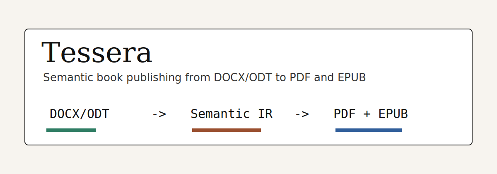
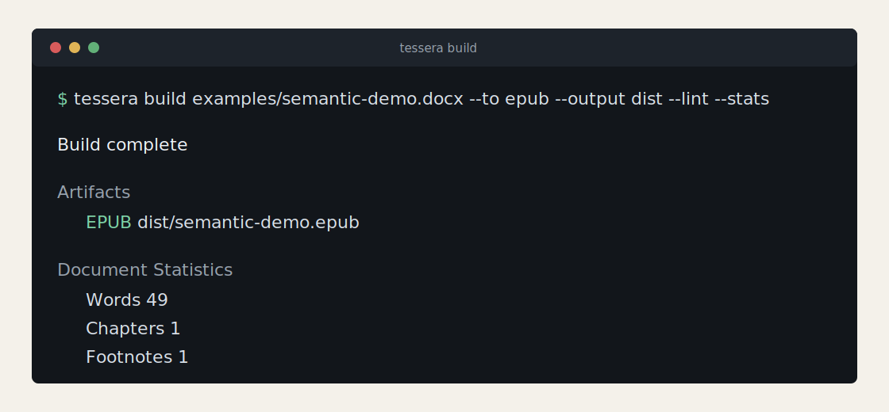

# Tessera



[](https://github.com/balyakin/tessera/actions/workflows/ci.yml)
[](LICENSE)
[](https://pkg.go.dev/github.com/balyakin/tessera)
[](https://github.com/balyakin/tessera/pkgs/container/tessera)

Tessera is a command-line publishing tool for manuscripts written in Word or LibreOffice. It reads DOCX and ODT files, keeps named styles as semantic structure, and builds EPUB, LaTeX, and PDF artifacts from the same source.

The important part is what Tessera refuses to throw away. If an author marks a paragraph as `Poem`, `Letter`, or `Epigraph`, or marks inline text as `Foreign - Latin` or `Direct Thought`, that meaning survives the conversion. It does not get flattened into "some italic text with a bit of indentation".



## Quick Start

Install the CLI and build the embedded demo:

```sh
go install github.com/balyakin/tessera/cmd/tessera@latest
tessera demo --output tessera-demo
```

That command writes an EPUB to:

```text
tessera-demo/dist/semantic-demo.epub
```

The demo path is deliberately small: it builds an EPUB without TeX Live, Docker, or network access after the binary is installed.

## Build a Manuscript

For an EPUB-only build:

```sh
tessera build book.docx --to epub --output dist --lint
```

For both print and ebook output:

```sh
tessera build book.docx --output dist --lint
```

Local PDF builds use LuaLaTeX by default. If your machine is not set up for TeX, the Docker image includes the runtime pieces:

```sh
docker run --rm -v "$PWD:/work" ghcr.io/balyakin/tessera:latest \
  build /work/examples/semantic-demo.docx --output /work/dist --lint
```

Run this when something on the machine looks suspicious:

```sh
tessera doctor
```

It checks for PDF and EPUB tooling and prints the next useful command instead of leaving you to guess at missing tools.

## Why It Exists

Most manuscript converters are good at moving text from one container to another. They are much weaker when a publisher has used styles as meaning:

| Manuscript intent | Generic conversion often becomes | Tessera keeps it as |
| --- | --- | --- |
| A poem | indented paragraphs | `verse` in IR, LaTeX, and EPUB semantics |
| A letter | ordinary body text | a `letter` block |
| An epigraph | styled quotation | an `epigraph` role |
| Latin text | italics | language-aware foreign text |
| Direct thought | italics | a distinct `thought` role |

That difference matters later. A book designer can adjust the LaTeX macro for every poem. An EPUB workflow can lint semantic XHTML. A CI job can compare canonical IR instead of guessing whether two rendered files mean the same thing.

Tessera does not try to infer meaning from visual formatting. The source of truth is the style name in the manuscript, plus the explicit mapping in `tessera.toml`.

## Semantic Example

In Word or LibreOffice, a manuscript can use ordinary named styles:

```text
Paragraph style: Poem
Character style: Foreign - Latin
Character style: Direct Thought
```

Tessera preserves those names as roles, then renders them as explicit output semantics.

LaTeX:

```tex
\begin{verse}
\textlatin{veritas}
\semThought{a private thought}
\end{verse}
```

EPUB XHTML:

```xml
<blockquote epub:type="z3998:poem">
  <i xml:lang="la">veritas</i>
  <i epub:type="z3998:thought">a private thought</i>
</blockquote>
```

## Inspect Before Building

Use `inspect` when you receive a manuscript from an author or editor:

```sh
tessera inspect book.docx
```

It lists paragraph styles, character styles, detected metadata, and whether each style maps to a known role. Unknown styles include suggested TOML snippets, so the fix is usually a small config change rather than a hunt through generated XHTML.

Start a config file with:

```sh
tessera init --output tessera.toml
```

The default mapping covers common English and Russian style names. Project-specific names belong in `[paragraph_styles]` and `[character_styles]`.

## Commands You Will Actually Use

```sh
tessera build book.docx --output dist --lint
tessera build book.odt --to epub --output dist --dump-ir dist/book.ir.json
tessera inspect book.docx
tessera lint dist/book.epub
tessera doctor
tessera version --format json
tessera completion bash
```

Build, inspect, lint, and version output JSON for scripts:

```sh
tessera build book.docx --to epub --output dist --format json
```

## GitHub Action

```yaml
name: books
on: [push]

jobs:
  build:
    runs-on: ubuntu-latest
    steps:
      - uses: actions/checkout@v4
      - uses: balyakin/tessera@v1
        with:
          input: examples/semantic-demo.docx
          output: dist
          args: --lint
      - uses: actions/upload-artifact@v4
        with:
          name: tessera-artifacts
          path: dist
```

## Go Library

Tessera is also a small Go API around the same parser and renderers used by the CLI:

```go
package main

import "github.com/balyakin/tessera/pkg/tessera"

func main() {
	doc, issues, err := tessera.ParseFile("book.docx", tessera.Options{})
	if err != nil {
		panic(err)
	}
	_ = issues

	epubBytes, renderIssues, err := tessera.RenderEPUB(doc, tessera.Options{Reproducible: true})
	if err != nil {
		panic(err)
	}
	_ = renderIssues
	_ = epubBytes
}
```

The IR can be marshaled as canonical JSON for golden tests, debugging, or external tools:

```go
data, err := tessera.MarshalIR(doc)
```

## Development

Requirements:

- Go 1.22 or newer.
- LuaLaTeX or XeLaTeX for local PDF builds.
- `epubcheck` if you want external EPUB validation in addition to Tessera's built-in lint pass.

Useful local commands:

```sh
make build
make test
make lint
make cover
```

The example manuscripts are generated from source fixtures:

```sh
go run ./internal/demo/generate
```

## Documentation

- [Style guide](docs/styles-guide.md)
- [Config reference](docs/config-reference.md)
- [Docker image](docs/docker.md)
- [GitHub Action](docs/github-action.md)
- [Roadmap](docs/roadmap.md)
- [Launch plan](docs/launch-plan.md)

## Project Status

Tessera is early, but the core shape is already in place: DOCX and ODT parsing, semantic IR, EPUB output, LaTeX output, CLI commands, Docker packaging, a GitHub Action, and tests around the parser and renderers.

The project is intentionally narrow. It is not a GUI, a SaaS uploader, a Markdown converter, or a visual style inference engine. It is a publishing pipeline for manuscripts where named styles carry the book's structure.

## License

MIT. See [LICENSE](LICENSE).
